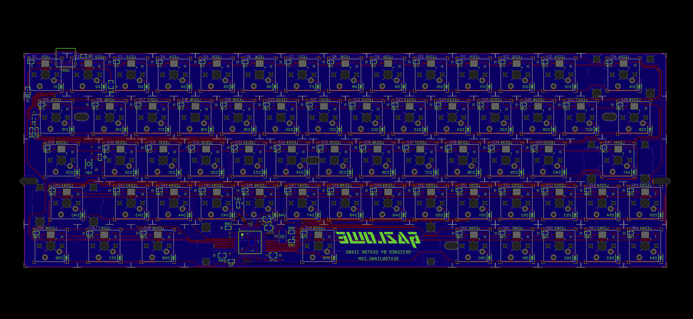

[English](README.md) | 简体中文

<p align="center">
    
</p>

<p align="center">
    <a href="https://github.com/seatonjiang/gazlowe/issues">
        
    </a>
    <a href="https://github.com/seatonjiang/gazlowe/pulls">
        
    </a>
    <a href="https://github.com/seatonjiang/gazlowe/blob/main/LICENSE">
        
    </a>
</p>

<p align="center">
    <a href="https://github.com/seatonjiang/gazlowe/issues">报告问题</a>
    ·
    <a href="https://github.com/seatonjiang/gazlowe/issues">功能需求</a>
</p>

<p align="center">自定义功能和键位布局的 64 键键盘</p>

## ✨ 键盘简介

Gazlowe 是一款 64 键的键盘，相较于常见的 60% 键盘新增了方向键，并且在方向键周围新增了两个自定义按键。Gazlowe 主板搭载了一颗 `ATMEGA32U4-AU` 芯片，LED 采用反贴的 `WS2812-3528` 提供了很赞的感官体验，并且可以自定义矩阵，这大概是研发工程师的理想键盘！

## 📷 键盘图片

### 成品展示

<p align="center">
    
</p>

### 主板渲染

<p align="center">
    
</p>

### Gerber 预览

<p align="center">
    
</p>

## 🛠️ 固件编译

Gazlowe 的固件使用 QMK 构建，如需编译固件请参考搭建 QMK 开发环境的[说明文档](https://docs.qmk.fm/#/newbs_getting_started)，QMK 固件也可以通过 [ruiqimao/qmkbuilder](https://github.com/ruiqimao/qmkbuilder) 项目生成，生成的固件可以通过 [noroadsleft/kbf_qmk_converter](https://github.com/noroadsleft/kbf_qmk_converter) 项目转换成配置文件。本项目的默认固件可以从 [Releases](https://github.com/seatonjiang/gazlowe/releases) 页面获取。

### 第一步：复制目录

将项目中 `firmware/gazlowe` 目录复制到 `qmk_firmware/keyboards/` 目录下。

### 第二步：编译固件

使用 `qmk compile` 命令编译固件，`default` 指的是键盘布局：

```bash
qmk compile -kb gazlowe -km default
```

### 第三步：烧录固件

将键盘与电脑连接，通过点按主板底部的 `RESET` 按钮，使键盘进入 DFU（引导加载程序）模式，`Windows` 或 `macOS` 平台可以使用 [QMK Toolbox](https://github.com/qmk/qmk_toolbox/releases) 烧录固件，`Linux` 平台需要使用下面的命令进行烧录：

```bash
qmk flash -kb gazlowe -km default
```

## ⚙️ 主板打样

PCB 设计已通过完整功能性测试，项目的 `Gerber` 文件可以从 [Releases](https://github.com/seatonjiang/gazlowe/releases) 页面获取，文件中包含了全部的工艺层。打样下单时电路板厚度选择 `1.6 mm`，外层铜厚选择 `1 盎司`，焊盘喷镀建议选择 `沉金`（也可以选择 `有铅喷锡`），沉金厚度选择 `1U`，最后下单时备注 `不需要半孔工艺`。

## ⌨️ 规格信息

### 键盘布局

默认的固件编译了三层布局（下面展示的是默认布局），更详细的键盘布局请参阅[说明文档](https://github.com/seatonjiang/gazlowe/blob/main/layout/README.zh-CN.md) 。

<p align="center">
    
</p>

### 键帽尺寸

有关键帽尺寸和对应数量等详细内容，请参阅[说明文档](https://github.com/seatonjiang/gazlowe/blob/main/layout/keycap/README.zh-CN.md) 。

<p align="center">
    
</p>

### 定位板与卫星轴

有关卫星轴尺寸和对应数量等详细内容，请参阅[说明文档](https://github.com/seatonjiang/gazlowe/blob/main/plate/README.zh-CN.md) 。

<p align="center">
    
</p>

## 📂 目录结构

下面是整个项目的文件夹结构（仅展示主目录文件夹，文件夹内容被忽略）。

```bash
gazlowe
├── bom
│   └── (some bom files)
├── firmware
│   └── (some firmware files)
├── graphics
│   └── (some graphics files)
├── layout
│   └── (some layout files)
├── pcb
│   └── (some pcb files)
├── plate
│   └── (some plate files)
└── schematic
    └── (some schematic files)
```

## 🤝 参与共建

我们欢迎所有的贡献，你可以将任何想法作为 pull requests 或 issues 提交，顺颂商祺 :)

## 📃 开源许可

项目基于 GNU 通用公共许可证 v3.0 发布，详细说明请参阅 [LICENCE](https://github.com/seatonjiang/gazlowe/blob/main/LICENSE) 文件。